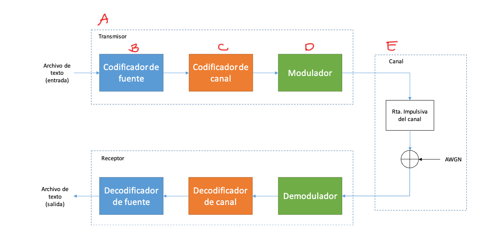

# Cómo está armado el sistema

Este es el diagrama de bloques del enunciado:

El sistema completo es: **Transmisor** (codifica el texto y lo prepara para enviar) → **Canal** (donde el mensaje se puede corromper, por ruido) → **Receptor** (recibe y reconstruye el texto original).

## Codigo: 
| Bloque del diagrama | Qué hace | Estado |
|---|---|---|
| **B** — Codificador/Decodificador de fuente (Huffman) | Convierte el texto en 0s y 1s de la forma más corta posible, y lo reconstruye del otro lado | ✅ Listo — ver el detalle en [MODULO_B.md](MODULO_B.md) |
| **C** — Codificador/Decodificador de canal | Le agrega al mensaje información extra para poder detectar y corregir errores | ⏳ Todavía no arrancamos, se agrega más adelante |
| **D** — Modulador/Demodulador | Convierte los 0s y 1s en señales que se pueden transmitir | ⏳ Todavía no arrancamos |
| **E** — Canal (ruido) | Simula que el mensaje se ensucia un poco en el camino | ⏳ Todavía no arrancamos |

Por ahora, `src/main.py` hace esto: lee el texto → lo codifica con Huffman → lo decodifica → compara si dio igual al original. Cuando avancemos con los próximos módulos, se va a ir sumando un paso más en el medio (por ejemplo, entre "codificar" y "decodificar" va a aparecer la modulación y el canal).

## Los archivos de código

- `src/main.py` — el programa principal. Llama, en orden, a las funciones de los demás archivos.
- `src/cli.py` — se encarga de leer los parámetros y mostrar los mensajes por pantalla, para que `main.py` sea más corto y fácil de leer.
- `src/source.py` — toda la lógica de Huffman (Módulo B). **Completo.**
- `src/report.py` — arma el informe del Módulo B (tablas y ejemplos) en un `.md` dentro de `results/`.
- `checks/verify_huffman.py` — script aparte para comparar nuestro Huffman contra una librería de Python (no lo usa el programa).

Cuando lleguemos a los módulos C, D y E, se van a crear los archivos correspondientes (por ejemplo `channel.py`, `modulation.py`) siguiendo la misma idea: un archivo por módulo, con funciones bien explicadas.
